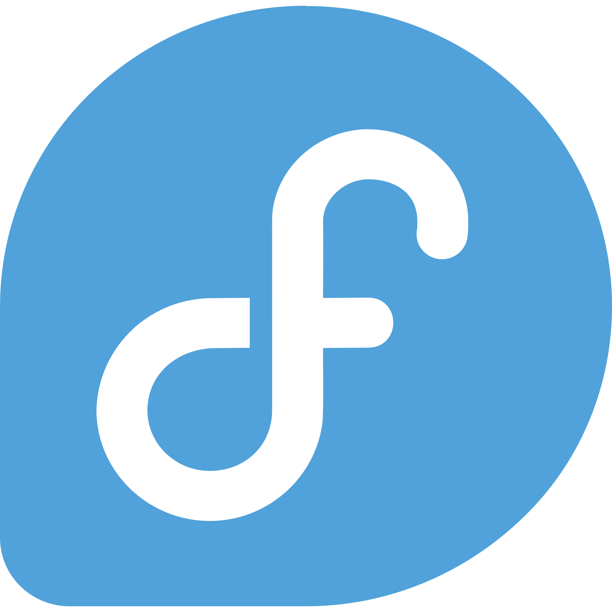
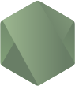

# Leonardo Nicolas 

🇧🇷Para ver mais detalhes completo sobre mim, [clique aqui](https://github.com/leonardon397/leonardon397/blob/main/FULL-ABOUT-ME.md).🇧🇷 
 
🇺🇸 To see more full details about me, [click here](https://github.com/leonardon397/leonardon397/blob/main/FULL-ABOUT-ME.md). 🇬🇧

