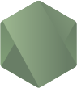
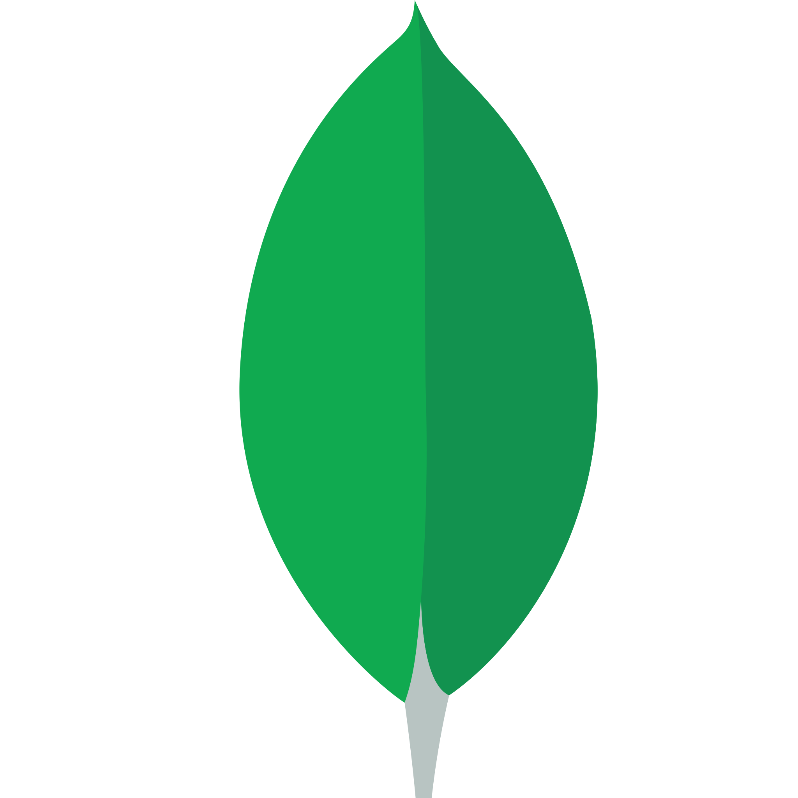

# Leonardo Nicolas 

<!--  -->

     
        Para ver mais detalhes completo sobre mim, <a href="./FULL-ABOUT-ME-BR.md">clique aqui</a>.
      

    
        To see more full details about me, 
        <a href="./FULL-ABOUT-ME-EN.md">Click here</a>.
      

 

  
  
  
  
  
  
  
  
  
  
  
  
  
  
  
  
  
  
  
  
  
  
  
    

<table cellpadding="0" cellspacing="0" border="0">
    <tr>
        <td> </td>
        <td></td>
    </tr>
    <tr>
        <td colspan="2" align="center">
             Ensino superior em andamento...  
             College in progress... 
        </td>
    </tr>
</table>

  
  

